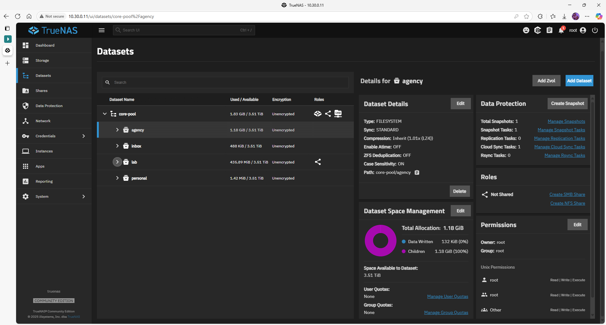

# Dataset Structure 

## Quick-view topology



---

## Rationale

| Tier      | Main purpose                              | Suggested ACL                       |
|-----------|-------------------------------------------|-------------------------------------|
| `lab/`    | Homelab automation, backups, repos        | `lab_admins` RW · `lab_users` R     |
| `agency/` | Company documents, finance, products      | `agency_admins` RW · role groups R  |
| `inbox/`  | Staging area for uploads / scans / temp   | everyone RW · nightly purge cronjob |

---

## Full layout – **datasets inside `core-pool` only**

```text
core-pool/
├─ lab/
│  └─ backups/
├─ agency/
└─ inbox/

```

## Commands Used

# ---------- LAB -----------------------------------------------------------
zfs create core-pool/lab
zfs create core-pool/lab/backups

# ---------- AGENCY --------------------------------------------------------
zfs create core-pool/agency

# ---------- INBOX ---------------------------------------------------------
zfs create core-pool/inbox

## Validation & smoke test
zfs list -r core-pool

