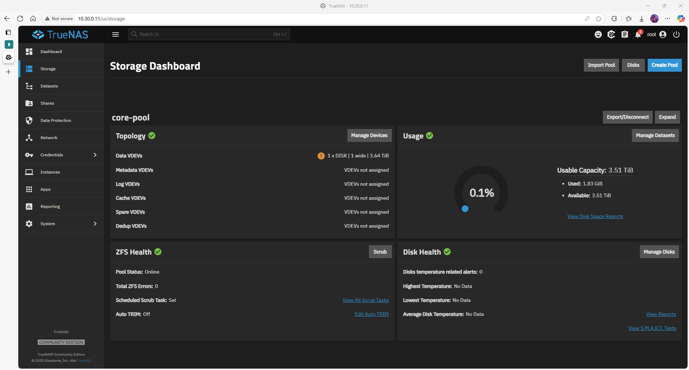

# ZFS Pool Configuration – *core-pool*

## Quick-view matrix

| Setting        | Value           | Notes                          |
|----------------|-----------------|--------------------------------|
| Pool name      | `core-pool`     | Single-disk lab pool           |
| Vdev layout    | 1 × stripe      | 4 TB USB HDD                   |
| Sector size    | `ashift=12`     | 4 KB alignment, good for SSD/HDD |
| Compression    | `lz4`           | Default for SCALE              |

---

## Prerequisites

- TrueNAS SCALE Web UI available  
- A spare disk visible as `/dev/sdb` (`4 TB USB HDD`)  
- No important data on that disk – operation is destructive

---

## Step 1 – Create the pool (CLI)

```bash
zpool create -f -o ashift=12 core-pool /dev/sdb
```

---

## Step 2 – Enable compression

```bash
zfs set compression=lz4 core-pool
```

---

## Validation

```bash
zpool status core-pool
zfs get compression core-pool
```

