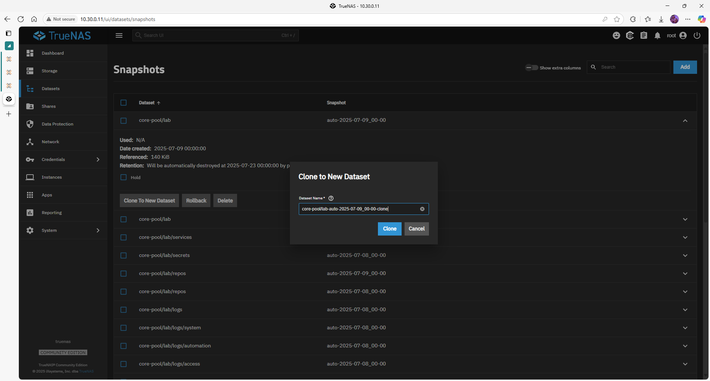

# Snapshot Restoration – TrueNAS SCALE

Snapshots are point-in-time copies of datasets. You can:

* **Browse** them (Shadow Copies)  
* **Clone** to a separate dataset for granular restore  
* **Rollback** an entire dataset after ransomware or data loss

---

## 1 – List available snapshots

1. **Datasets** ▸ locate the dataset  
2. Click the **⋮** (three-dots) ▸ **View Snapshots**  
3. All snapshot names + timestamps appear.

---

## 2 – Restore individual files (Windows Shadow Copy)

1. Open **File Explorer** → `\\10.30.0.11\lab`  
2. Right-click folder ▸ **Restore previous versions**  
3. Select a snapshot → **Open** (browse) or **Restore** (overwrite)

> Requires `vfs_shadow_copy2` enabled in SMB service.

---

## 3 – Clone a snapshot (GUI)

1. **Datasets** ▸ **View Snapshots**  
2. **⋮** next to snapshot ▸ **Clone to New Dataset**  
3. Name it e.g. `restore-lab-YYYY-MM-DD` ▸ **Submit**



The clone appears as a separate dataset; share it temporarily to extract files.

---

## 4 – Rollback an entire dataset

> **Danger:** all changes after the snapshot are deleted.

1. **View Snapshots** ▸ **⋮** on snapshot  
2. **Rollback** ▸ Confirm dialog

---

## 5 – CLI examples

```bash
# Roll back dataset to a specific snap
zfs rollback core-pool/lab@auto-2025-07-08_00-00

# Clone a snapshot
zfs clone core-pool/lab@auto-2025-07-08_00-00 \
          core-pool/restore-lab-2025-07-08
```

## Best practices

| Tip                                            | Why                     |
| ---------------------------------------------- | ----------------------- |
| Take snapshots **before risky changes**        | Quick safety net        |
| Use **recursive** snapshots                    | Captures child datasets |
| Combine with **Cloud-Sync** or **Replication** | Off-site protection     |

## Related guides

 -[Periodic Snapshots](https://chatgpt.com/g/g-p-686d8ad6e9b08191b46ee400fcf8105c-gituhub-repos/c/cloud_sync.md)
 -[Cloud-Sync Tasks](https://chatgpt.com/g/g-p-686d8ad6e9b08191b46ee400fcf8105c-gituhub-repos/c/cloud_sync.md)